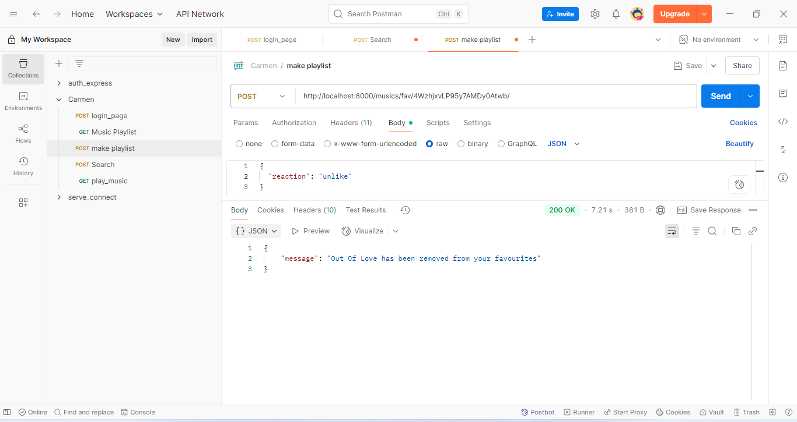

# CARMEN LISTEN

## Overview

Music Explorer API is a backend-only web service built with Django Rest Framework (DRF) that enables users to search for music tracks, view track metadata, and manage a personalized list of favourite songs.

This project integrates with the Spotify Scraper API (via RapidAPI).

## Features
### Music Search

### Get Track 

### Add or remove Track from user's playlist 

### Retrieve User's playlist 

